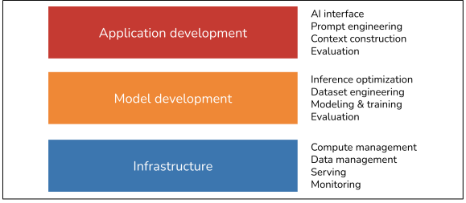

# Chapter 1: Introduction to Building AI Applications with Foundation Models
## Three Layers of AI Stack
There are three layers to any AI application stack: application development, model
development, and infrastructure. When developing an AI application, you’ll likely
start from the top layer and move down as needed:

**Application development**  
With models readily available, anyone can use them to develop applications. ... Application development involves providing a model with good
prompts and necessary context. This layer requires rigorous evaluation. Good
applications also demand good interfaces.

**Model development**  
This layer provides tooling for developing models, including frameworks for
modeling, training, finetuning, and inference optimization. Because data is central to model development, this layer also contains dataset engineering. Model development also requires rigorous evaluation.

**Infrastructure**  
At the bottom is the stack is infrastructure, which includes tooling for model
serving, managing data and compute, and monitoring.

## AI Engineering Versus ML Engineering
At a high level, building applications using foundation models today differs
from traditional ML engineering in three major ways:
1. Without foundation models, you have to train your own models for your
applications. With AI engineering, you use a model someone else has
trained for you. **This means that AI engineering focuses less on modeling
and training, and more on model adaptation**.
2. AI engineering works with models that are bigger, consume more
compute resources, and incur higher latency than traditional ML
engineering. This means that **there’s more pressure for efficient training
and inference optimization**. A corollary of compute-intensive models is
that many companies now need more GPUs and work with bigger
compute clusters than they previously did, which means **there’s more
need for engineers who know how to work with GPUs and big clusters**.
3. AI engineering works with models that can produce **open-ended outputs**.
Open-ended outputs give models the flexibility to be used for more
tasks, but they are also harder to evaluate. **This makes evaluation a much
bigger problem in AI engineering**.

...**model adaptation techniques** can be divided into two categories, depending on whether they require updating model weights.
1. **Prompt-based techniques**, which include prompt engineering, adapt a
model without updating the model weights.
2. **Finetuning**, on the other hand, requires updating model weights. You adapt
a model by making changes to the model itself

## Pre-Training, Finetuning, and Post-Training
**Pre-training** 
refers to training a model from scratch—the model weights are randomly initialized. For LLMs, pre-training often involves training a model for text completion. Out of all training steps, pre-training is often the most resource-intensive by a long shot

**Finetuning** 
Finetuning means continuing to train a previously trained model—the model
weights are obtained from the previous training process. Because the model
already has certain knowledge from pre-training, finetuning typically requires
fewer resources (e.g., data and compute) than pre-training.

**Post-training** 
Many people use post-training to refer to the process of training a model after the pre-training phase. ... It’s usually post-training when it’s done by
model developers ... It’s finetuning when it’s done
by application developers

## Dataset Engineering
refers to curating, generating, and annotating the data needed for training and adapting AI models.

category    | Traditional ML Engineering | AI Engineering |
---------- | :--------- | :----------: | 
use cases | most are close-ended—a model’s output can only be among predefined values. | open-ended  | 9999999999
data type | tabular (mostly)  | unstructured    | 
tasks   | feature engineering   | deduplication, tokenization, context retrieval, and quality control,    | 

Many people argue that because models are now commodities, data will be the main differentiator, making dataset engineering more important than ever.

## Evaluation
Evaluation is about mitigating risks and uncovering opportunities. Evaluation is necessary throughout the whole model adaptation process. Evaluation is
needed to:
- select models
- benchmark progress
- determine whether an application is ready for deployment
- detect issues and opportunities for improvement in production.

these challenges chiefly arise from foundation models’ open-ended nature and expanded capabilities.
For example, in close-ended ML tasks like fraud detection, there are usually expected ground truths that you can compare your model’s outputs against. If a model’s output differs from the expected output, you know the model is wrong. For a task like chatbots, however, there are so many possible responses to each prompt that it is impossible to curate an exhaustive list of ground truths to compare a model’s response to.

The existence of so many adaptation techniques also makes evaluation harder. A system that performs poorly with one technique might perform much better with
another.

## Inference optimization
Inference optimization means making models faster and
cheaper. ...  
One challenge with foundation models is that they are often autoregressive—tokens
are generated sequentially

## Application development  
With traditional ML engineering, where teams build applications using their proprietary models, the model quality is a differentiation. With foundation models, where
many teams use the same model, differentiation must be gained through the applica‐
tion development process.
The application development layer consists of these responsibilities: evaluation,
prompt engineering, and AI interface.

## Prompt engineering and context construction.
Prompt engineering is about getting AI
models to express the desirable behaviors from the input alone, without changing the
model weights. ... Prompt engineering is not just about telling a model what to do. It’s 
also about giving the model the necessary context and tools to do a given task

## AI interface
AI interface means creating an interface for end users to interact with
your AI applications. Before foundation models, only organizations with sufficient resources to develop AI models could develop AI applications.
...   With foundation models, anyone can build AI applications.

## AI Engineering vs Full-stack Engineering
With traditional ML engineering, you usually start with gathering data and training a model. Building the product comes last. However, with AI models readily available today, it’s possible to start with building the product first, and only invest in data and models once the product shows promise

In traditional ML engineering, model development and product development are
often disjointed processes, with ML engineers rarely involved in product decisions at many organizations. However, with foundation models, AI engineers tend to be much more involved in building the product.

